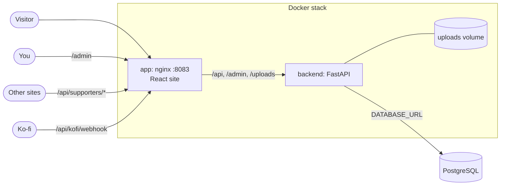

# stella-profile
My profile



## Setup

```sh
cp .env.example .env          # fill it in
docker compose up -d --build  # prod: -f compose.prod.yaml

# first run only
docker compose cp export.csv backend:/tmp/kofi.csv
docker compose exec backend python -m app.kofi_import /tmp/kofi.csv
docker compose exec backend python -m app.seed
```

Ko-fi webhook URL: `https://<your-domain>/api/kofi/webhook`
